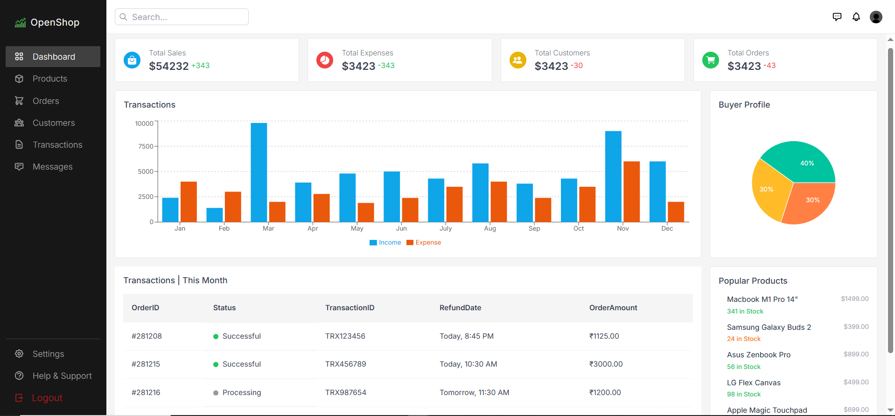
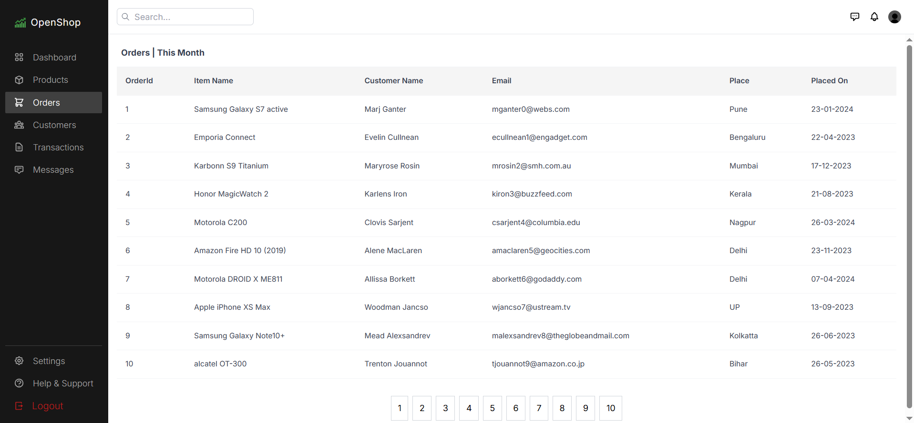
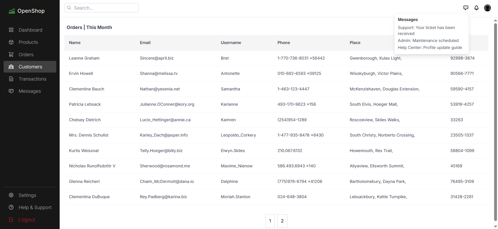
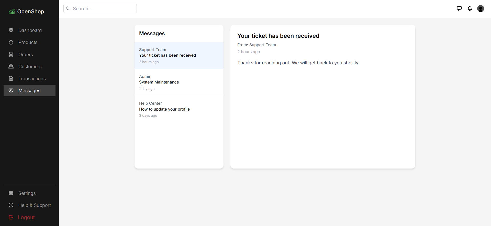
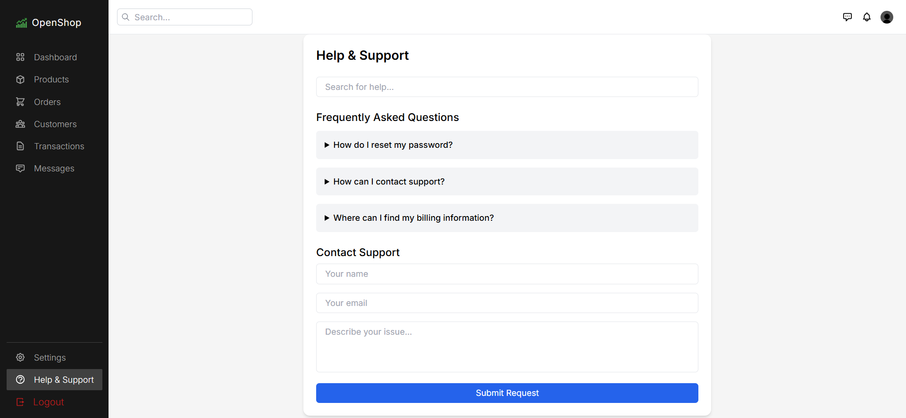

# OpenShop dashboard using TailwindCSS and reactJs.
- used react-router-dom
- used react fonts,
- used classname to use multiple classname in sidebar.jsx
- used google fonts
- used custom styles @layer in index.css
- used recharts for charts
- used react-icons
- mockaroo for dummy json data

#### Dashboard

#### OrderDetails

### customerDetails

#### Messages

#### help

